# Yocto/Hair: Tiny Path Tracer Extension to Shade Realistic-Looking Hairs

**Authors:** [Antonio Musolino](https://github.com/antoniomuso) and [Davide Sforza](https://github.com/dsforza96).

Yocto/Hair is a tiny extension of [Yocto/GL](https://github.com/xelatihy/yocto-gl) which allow to shade realistic-looking hairs. 
Our code follows the [pbrt](https://www.pbrt.org/hair.pdf) implementation.

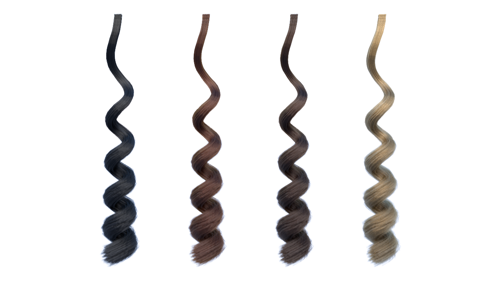

## Geometry
We tested our implementation using hair models from Benedikt Bitterli's [Rendering Resources](https://benedikt-bitterli.me/resources). We converted *.pbrt* scenes into Yocto/GL *.json* scene format.
Because Yocto/GL does not support Bézier curves, we approximated them with straight lines. We used two and four lines for each Bézier curve to render straight and curly hairs, respectively. We also stored curves tangents and linear interpolated widths for each vertex. To optimize rendering performances, we joined all the lines belonging to the same model into one only *.ply* shape.

All converted models can be downloaded [here](https://drive.google.com/drive/folders/1dxACwl7tILq09_3m-KPaIRDEbdolVmo2?usp=sharing).

## Scattering Model Implementation
Our implementation follows straightforwardly the one presented in the pbrt chapter. To respect the Yocto/GL convention, we implemented three new functions:
- `eval_hair_scattering(...)`: evaluates hair BRDF lobes according to the input incoming and outgoing directions. As for the other functions which evaluate BRDF lobes, we folded the product by the cosine between the incoming direction and the shading normal inside this function;
- `sample_hair_scattering(...)`: given an outgoing direction, samples an incoming direction according to the hair BRDF;
- `eval_hair_scattering_pdf(...)`: returns the PDF for hair BRDF sampling related to the given incoming and outgoing directions.

The function `eval_hair_brdf(...)` is responsible to evaluate the input hair material together with the *v* coordinate of the ray-line intersection and to return the corresponding hair BRDF lobes. Since pbrt computations are made in the BRDF coordinate system, we built a frame to convert from world to local BRDF coordinate systems and vice versa. The *z* axis of this frame is orientend along the shading normal, while the *x* axis is orientend along the line tangent.

## Hair Material
We extended the `material` structure present in Yocto/GL with the parameters needed for hair shading. These parameters are:
- `sigma_a`: the absortion coefficent;
- `beta_m`: the longitudinal roughnesses, `0.3` by default;
- `beta_n`: the azimuthal roughnesses, `0.3` by default;
- `alpha`: the hair scale angle in degrees, `2` by default;
- `eta`: the index of refraction of the interior of the hair, `1.55` by default;
- `eumelanin`: the eumelanin concentration;
- `pheomelanin`: the pheomelanin concentration.

Hair color can be specified in three different ways: direclty with the `color` parameter, through the absortion coefficient `sigma_a` or with the concentration of `eumelanin` and/or `pheomelanin`, which are the two pigments that determine the color in human hair.
An eumelanin concentration of about 8 gives black hair, 1.3 brown hair and 0.3 blonde hair. Pheomelanin is responsible for orage and red hairs.

## Examples
By changing the above parameters, it is possible to obtain different hair looks. In the following examples we show the effect of the variation of each parameter. All images have been rendered at the resolution of 720x720 pixels with 1536 samples per pixel.

### Longitudinal Scattering
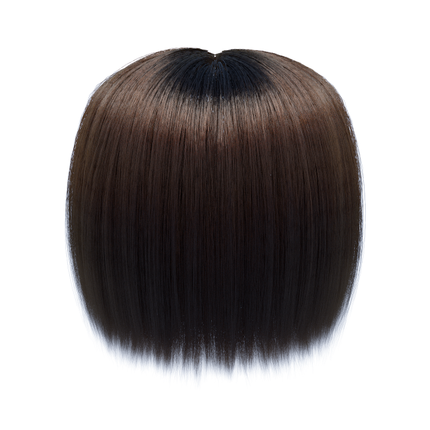 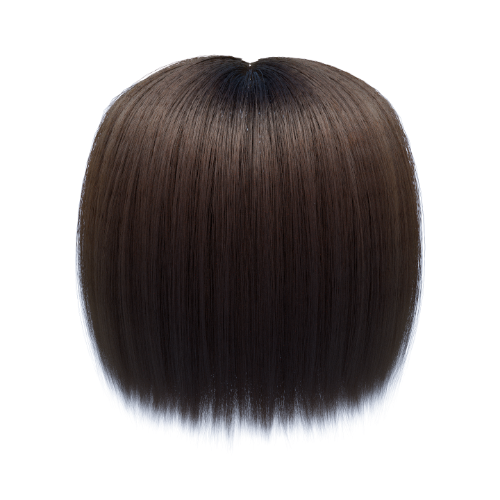 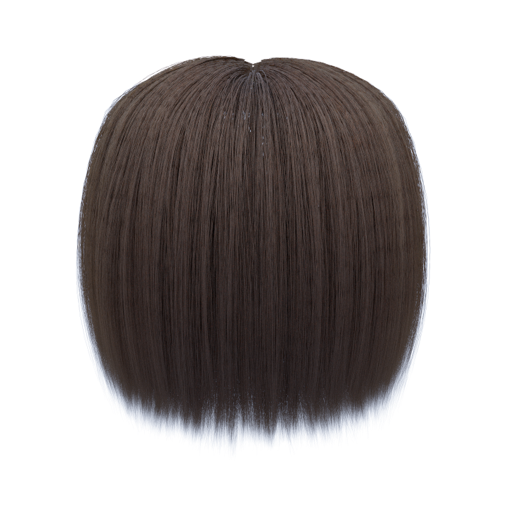

The first image is rendered with `beta_m = 0.1`, the second one with `beta_m = 0.25` and the third one with `beta_m = 0.6`. Longitudinal scattering is responsible for the highlight along the length of hair and the roughness controls the sharpness of this highlight.

### Absortion in Fibers
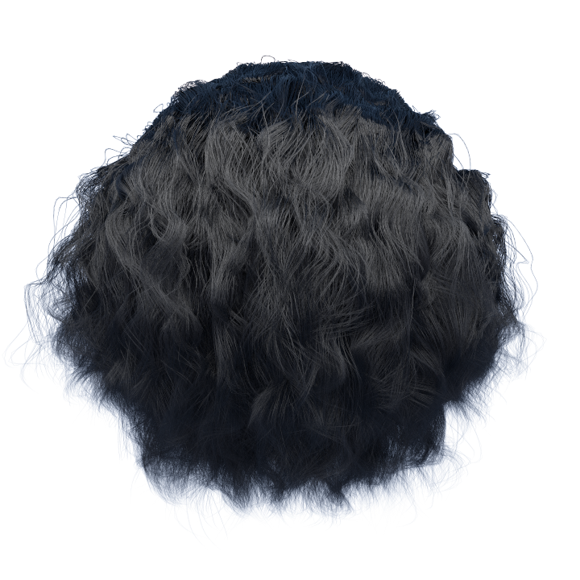 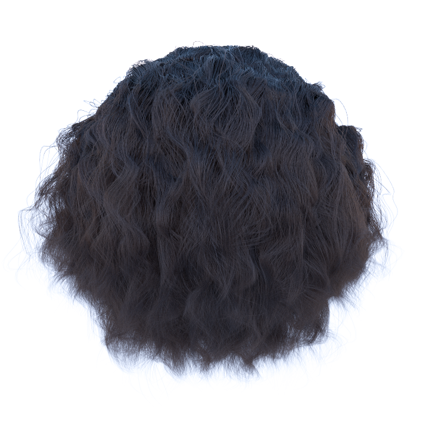 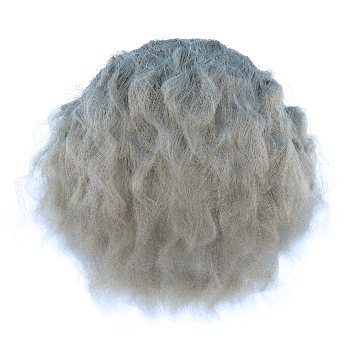

In the first image `sigma_a` is set to `{3.35, 5.58, 10.96}` (corresponding to black hair), in the second one to `{0.84, 1.39, 2.74}` (brown hair) and in the third one to `{0.06, 0.10, 0.20}` (blonde hair).

### Azimuthal Scattering
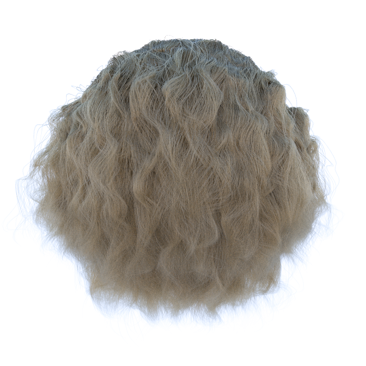 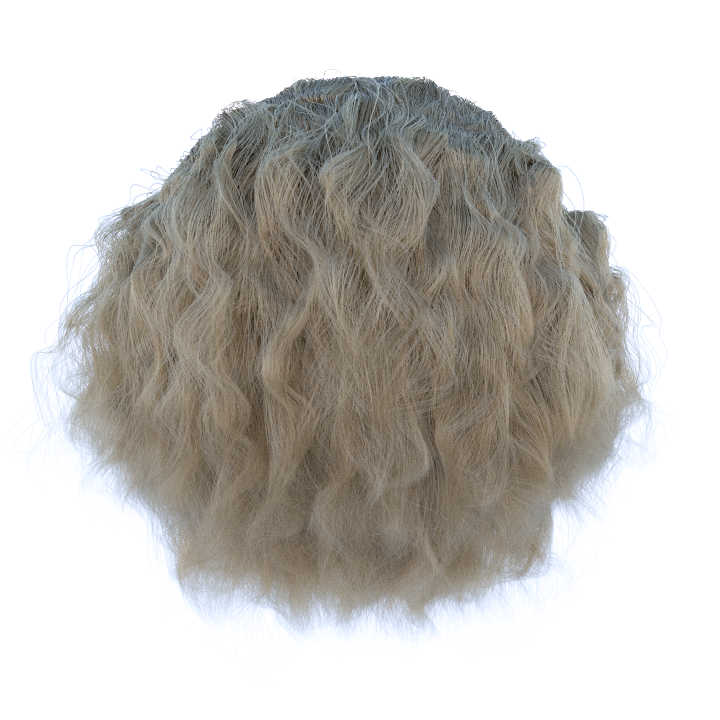 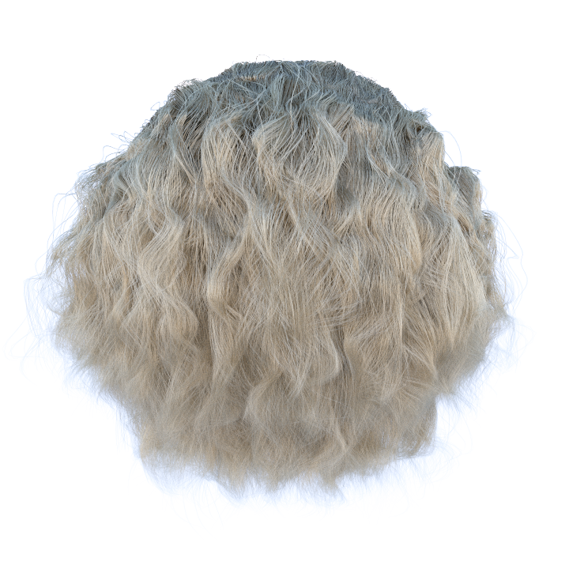

The first image is rendered with `beta_n = 0.3`, the second one with `beta_n = 0.6` and the third one with `beta_n = 0.9`. As the azimuthal roughness increases, hair get brighter.

### Scales on Hair Surface
<p align="center"> 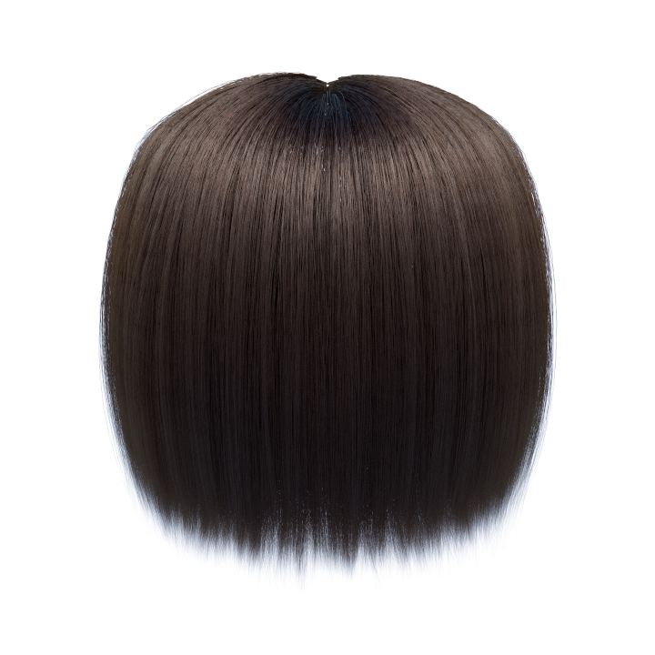  </p>

The first image is rendered without `alpha` (`0` degrees), while the second one with `alpha` set to `2` degrees. Scales on the hair surface are responsible for the secondary colored highlight below the white one.

## Tests
To check the correctness of our implemetation, we wrote the tests described in the pbrt chapter. Our code passes both the test which checks for energy conservation and the ones which validate the sampling routine. These tests have been useful to find and fix some errors we made during the implentation. They are included at the end of the file [`yocto_extension.cpp`](libs/yocto_extension/yocto_extension.cpp).

## Yocto/GL Files Modifications
Almost all our code is inside the [`yocto_extension.h`](libs/yocto_extension/yocto_extension.h) and the [`yocto_extension.cpp`](libs/yocto_extension/yocto_extension.cpp) files. However, we left some small modifications inside the main library. The files we modified are:
- [`yocto_pbrt.h`](libs/yocto/yocto_pbrt.h), [`yocto_sceneio.h`](libs/yocto/yocto_sceneio.h) and [`yocto_sceneio.cpp`](libs/yocto/yocto_sceneio.cpp): to add lines support to *.pbrt* parsing and to read *.json* files containing the new material parameters;
- [`yocto_pathtrace.h`](libs/yocto_pathtrace/yocto_pathtrace.h), [`yocto_pathtrace.cpp`](libs/yocto_pathtrace/yocto_pathtrace.cpp): to integrate our modifications into the path tracer.

## How to Use
To compile the library follow the instructions in the [Yocto/GL](https://github.com/xelatihy/yocto-gl) repository. 
To render our scenes you have to download the hair models from [here](https://drive.google.com/drive/folders/1dxACwl7tILq09_3m-KPaIRDEbdolVmo2?usp=sharing). For example, if you want to render the curly hair scene you have to put the `curly-hair.ply` model in the [`tests/curly-hair/shapes/`](tests/curly-hair/shapes/) directory and run the command:

```bash
./bin/yscenetrace tests/curly-hair/curly-hair.json -o out/curly-hair.png -t path -s 1536 -r 720
```

#


Same scene rendered with and without our extension:

```bash
./bin/yscenetrace tests/sloth/sloth.json -o out/sloth.png -t path -s 2048 -r 1920
```

#

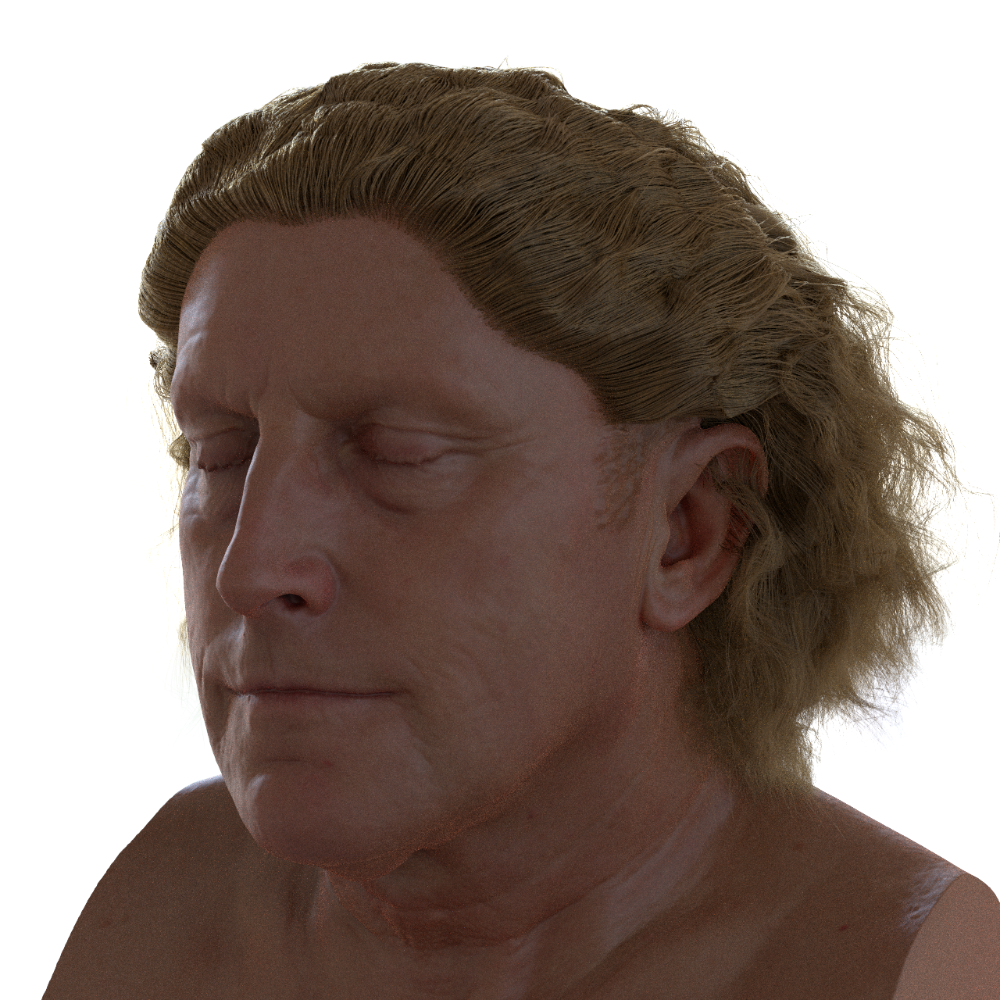

Example scene which exploits volumetric rendering to shade skin together with the model we implemented to shade hair. This way it is possible to render realistic-looking humans:

```bash
./bin/yscenetrace tests/bold-man/bold-man.json -o out/bold-man.png -t path -s 1024 -r 1280
```

## License
Our code is released under [MIT license](LICENSE). License informations for the models we used can be foud in [this file](tests/license.txt).
