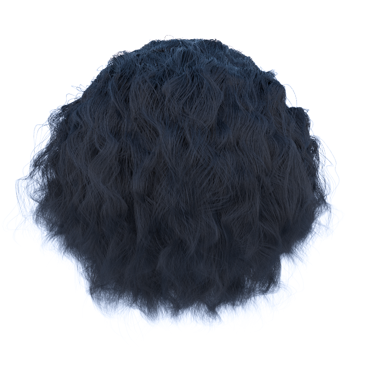

# Yocto/Hair: Tiny Path Tracer Extension to Shade Realistic-Looking Hairs

**Authors:** [Antonio Musolino](https://github.com/antoniomuso) and [Davide Sforza](https://github.com/dsforza96)

Yocto/Hair is a tiny extension of [Yocto/GL](https://github.com/xelatihy/yocto-gl) to shade realistic looking hairs. 
Our code follows the [pbrt](https://www.pbrt.org/hair.pdf) implementation.

## Geometry
We decided to test our implementation using hair models from [Benedikt Bitterli Rendering Resources](benedikt-bitterli.me/resources). We converted *.pbrt* scenes into Yocto/GL *.json* scenes format.
Because Yocto/GL doesn't support Bézier curves we approximated them into straight lines. We used two lines for each Bézier curve to render straight hairs and four lines to render curly hairs. We also store lines tangents and linear interpolated widths for each vertex.  To optimize the rendering performance we joined all the lines into one only *.ply* shape.

All converted models can be downloaded [here](https://drive.google.com/drive/folders/1dxACwl7tILq09_3m-KPaIRDEbdolVmo2?usp=sharing).

## Scattering Model Implementation
We followed straightforwardly the implementation presented in pbrt. To respect the Yocto/GL convention, we implemented three new functions:
- `eval_hair_scattering(...)`: Given incoming and outgoing directions computes the corrisponding BRDF lobes;
- `sample_hair_scattering(...)`: Given the outgoing direction sample an incoming direction according to BRDF;
- `eval_hair_scattering_pdf(...)`: Returns the PDF related to incoming and outgoing directions.

The function `hair_brdf(...)` is responsible to evaluate the input hair material. Since pbrt computations are made in local BRDF coordinate system, we built a frame to convert from world to BRDF coordinate system and vice versa. The *z* axis is orientend along the shading normal, while the *x* axis is orientend along the line tangent.

## Hair Material
We extended the `material` structure with the parameters needed for hairs. These parameters are:
- `sigma_a`: the absortion coefficent;
- `beta_m`: longitudinal roughnesses (`0.3` by default);
- `beta_n`: azimuthal roughnesses (`0.3` by default);
- `alpha`: hair scale angle in degrees (`2` by default);
- `eta`: the index of refraction of the interior of the hair (`1.55` by default);
- `eumelanin`: eumelanin concentration;
- `pheomelanin`: pheomelanin concentration.

Hair color can be specified in three different ways: direclty with the `color` parameter, through the absortion coefficient `sigma_a` or with the concentration of `eumelanin` and `pheomelanin`, which are the two pigments that determine the color in human hairs.

## Examples
By changing the material parameters, it is possible to obtain different hairs looks. In the following sections we show the effect of varying each parameter. 

### Longitudinal Scattering
  

The firts image is rendered with `beta_m = 0.1`, the second one with `beta_m = 0.25` and the third one with `beta_m = 0.6`. Longitudinal scattering is responsible for the highlight along the length of hair.

### Absortion in Fibers
  

In the firts image `sigma_a` is set to `{3.35, 5.58, 10.96}` (corresponding to black hairs), in the second one to `{0.84, 1.39, 2.74}` (brown hairs) and in the third one to `{0.06, 0.10, 0.20}` (blonde hairs).

### Aimuthal Scattering

  
The firts image is rendered with `beta_n = 0.3`, the second one with `beta_n = 0.6` and the third one with `beta_n = 0.9`. As the longitudinal roughness increases hairs get brighter.

### The Effect of Scales on Hair

The firts image is rendered without `alpha` (`0` degrees), while the second one with `alpha` set too `2` degrees. Scales are responsible for the secondary colored highlight below the white one.

## Tests
To check the correctness of our implemetation we write the test described in pbrt. We pass both the test which check for energy conservation and the ones which validate the sampling routine. These tests where useful to find some errors in our implentation. They are included at the end of the file [`yocto_extension.cpp`](libs/yocto_extension/yocto_extension.cpp).

## Yocto/GL Files Modifications
Almost all our code is iside the [`yocto_extension.h`](libs/yocto_extension/yocto_extension.h) and [`yocto_extension.cpp`](libs/yocto_extension/yocto_extension.cpp) file. However, we left some small modifications inside the main library:
- [`yocto_pbrt.h`](libs/yocto/yocto_pbrt.h), [`yocto_sceneio.cpp`](libs/yocto/yocto_sceneio.cpp) and [`yocto_sceneio.h`](libs/yocto/yocto_sceneio.h): to add lines support to *.pbrt* parsing and to read *.json* files containing the new material parameters;
- [`yocto_pathtrace.cpp`](libs/yocto_pathtrace/yocto_pathtrace.cpp), [`yocto_pathtrace.h`](libs/yocto_pathtrace/yocto_pathtrace.h): to integrate our modifications into the path tracer.

## License
Our code is released under [MIT](LICENSE) license.
